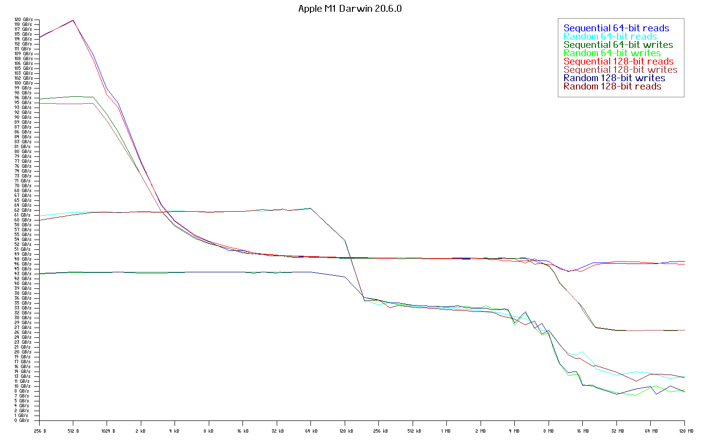
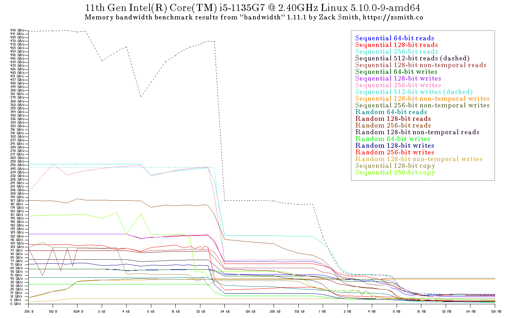
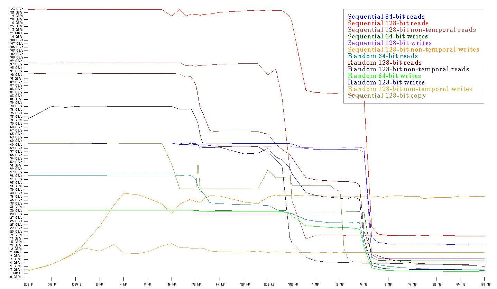

This is the README file for my program "bandwidth".

Bandwidth is a benchmark that attempts to measure
memory bandwidth. 

Bandwidth is useful because memory bandwidth need to
measured to give you a clear idea of what your computer
is capable of. Merely relying on specs does not 
provide a full picture as specs can be misleading.

--------------------------------------------------

My program "bandwidth" performs sequential and random
reads and writes of varying sizes. This permits 
you to infer from the graph how each type of memory 
is performing. So for instance when bandwidth
writes a 256-byte chunk, you know that because
caches are normally write-back, this chunk
will reside entirely in the L1 cache. Whereas
a 512 kB chunk will mainly reside in L2.

You could run a non-artificial benchmark and 
observe that a general performance number is lower 
on one machine or higher on anotehr, but that might
conceal the cause. 

So the purpose of this program is to help you 
hone in on the cause of good or bad system 
performance.

It also tells you the best-case scenario e.g.
the maximum bandwidth achieved using sequential
memory accesses is typically ideal.

Release 1.10:
	- ARM 64 support, ARM 32 refinements. Apple M1 support.
Release 1.9:
	- More object-oriented improvements. Fixed Windows 64-bit support. Removed Linux framebuffer test.
Release 1.8:
	- More object-oriented improvements. Windows 64-bit supported.
Release 1.7:
	- Separated object-oriented C (OOC) from bandwidth app.
Release 1.6:
	- Converted the code to my conception of object-oriented C.
Release 1.5:
	- Fixed AVX bug. Added --nice mode and CPU temperature monitoring (OS/X only).
Release 1.4:
        - Added randomized 256-bit AVX reader & writer tests (Intel64 only).
Release 1.3:
        - Added CSV output. Updated ARM code for Raspberry π 3.
Release 1.2:
        - Put 32-bit ARM code back in.
Release 1.1:
	- Added larger font.
Release 1.0:
	- Moved graphing into BMPGraphing module.
	- Finally added LODS benchmarking, which
	  proves how badly lodsb/lodsw/lodsd/lodsq
	  perform.
	- Added switches --faster and --fastest.
Release 0.32:
	- Improved AVX support.
Release 0.31:
	- Adds cache detection for Intel 32-bit CPUs
	- Adds a little AVX support.
	- Fixes vector-to/from-main transfer bugs.
Release 0.30 adds cache detection for Intel 64-bit CPUs.
Release 0.29 improved graph granularity with more
	128-byte tests and removes ARM support.
Release 0.28 added a proper test of CPU features e.g. SSE 4.1.
Release 0.27 added finer-granularity 128-byte tests.
Release 0.26 fixed an issue with AMD processors.
Release 0.25 maked network bandwidth bidirectional.
Release 0.24 added network bandwidth testing.

Release 0.23 added:
	- Mac OS/X 64-bit support.
	- Vector-to-vector register transfer test.
	- Main register to/from vector register transfer test.
	- Main register byte/word/dword/qword to/from 
	  vector register test (pinsr*, pextr* instructions).
	- Memory copy test using SSE2.
	- Automatic checks under Linux for SSE2 & SSE4.

Release 0.22 added:
	- Register-to-register transfer test.
	- Register-to/from-stack transfer tests.

Release 0.21 added:
	- Standardized memory chunks to always be
	  a multiple of 256-byte mini-chunks.
	- Random memory accesses, in which each 
	  256-byte mini-chunk accessed is accessed 
	  in a random order, but also, inside each 
	  mini-chunk the 32/64/128 data are accessed
	  pseudo-randomly as well. 
	- Now 'bandwidth' includes chunk sizes that 
	  are not powers of 2, which increases 
	  data points around the key chunk sizes 
	  corresponding to common L1 and L2 cache 
	  sizes.
	- Command-line options:
		--fast for 0.25 seconds per test.
		--slow for 20 seconds per test.
		--title for adding a graph title.

Release 0.20 added graphing, with the graph
stored in a BMP image file. It also adds the
--slow option for more precise runs.

Release 0.19 added a second 128-bit SSE writer
routine that bypasses the caches, in addition
to the one that doesn't.

Release 0.18 was my Grand Unified bandwidth
benchmark that brought together support for
four operating systems:
	- Linux
	- Windows Mobile
	- 32-bit Windows
	- Mac OS/X 64-bit
and two processor architectures:
	- x86
	- Intel64
I've written custom assembly routines for
each architecture.

Total run time for the default speed, which
has 5 seconds per test, is about 30 minutes.

--------------------------------------------------
This program is provided without any warranty
and AS-IS. See the file COPYING for details.

Zack Smith
1@zsmith.co
June 2019

Revision 47

© 2012-2023 by Zack Smith. All rights reserved.

# Introduction

My program, called simply *bandwidth,* is an artificial benchmark primarily for measuring memory bandwidth on x86 and x86_64 based computers, useful for identifying weaknesses in a computer's memory subsystem, in the bus architecture, in the cache architecture and in the processor itself.

`bandwidth` also tests some libc functions and, under GNU/Linux, it attempts to test framebuffer memory access speed if the framebuffer device is available.

This program is open source and covered by the GPL license. Although I wrote it mainly for my own benefit, I am also providing it pro bono, i.e. for the public good.

The latest `bandwidth` supports:

- 32- and 64-bit x86 GNU/Linux
- Raspberry pi 4 ARM running 64-bit Raspberry Pi OS
- Raspberry pi 3/4 ARM running 32-bit Raspberry Pi OS
- 64-bit x86 Windows
- 64-bit x86 Mac OS
- 64-bit M1 Mac OS

Thus it supports four processor architectures:

- i386
- x86_64
- ARM 64-bit (aarch64)
- ARM 32-bit (aarch32)

# Why write the core routines in assembly language?

For each architecture, I've implemented optimized core routines in assembly language.

The exact same core assembly language routines run on all computers of a given architecture. It is similar to using the same physical 12-inch ruler to measure multiple items.

This approach is vital. If the core routines were written in C or C++, as some people have done in other benchmarks, the final code that is executed would differ depending on the verson of the compiler and compilation options. That's like trying to measure something with multiple rulers, each being a somewhat more or less than 12 inches.

Measurement of anything requires a *standard*, a specific known thing to compare to.

- Each version of a compiler might produce different code.
- Each compilation might use different options.

Therefore core routines should *never* be written in a high-level language. They must always be coded in assembly. Because they have to be reliable tests.

# Comparing speeds of different memory types

How fast is each type of memory on a typical system? This is the kind of detail that students taking Computer Architecture are asked on exams.

Computer have registers, caches (typically 3 levels), dynamic RAM, and of course slow mass storage.

Here are results from a 2.4 GHz Core i5 520M and 1066 MHz RAM, from slowest to fastest.

- Reading from the Crucial m4 SSD: 250 MB/second.
- Reading from main memory (1066 MHz): 7 GB/second = 28 times faster.
- Reading from L3 cache: maximum 21 GB/second = 3 times faster than main memory or 86 times faster than SSD.
- Reading from L2 cache: maximum 29.5 GB/second = 1.4 times faster than L3; 4.2 times faster than main memory; or 120 times faster than SSD.
- Reading from L1 cache: maximum 44.5 GB/second = 1.5 times faster than L2; 2.1 times faster than L3; 6.4 times faster than main memory; or 178 times faster than SSD.

The SSD might be 4 times faster than a spinning hard disk drive.

# Observations of running one instance of bandwidth

The first interesting thing to notice is the difference in performance between 32, 64, and 128 bit transfers on the same processor. These differences show that if programmers were to go through the trouble to revise software to use 64 or 128 bit transfers, where appropriate and especially making them aligned to appropriate byte boundaries and sequential, great speed-ups could be achieved.

A second observation is the importance of having fast DRAM. The latest DRAM overclocked can give stupendous results.

A third observation is the remarkable difference in speeds between memory types. In some cases the L1 cache is more than twice as fast as L2, and L1 is up to 9 times faster than main memory, whereas L2 is often 3 times faster than DRAM.

[Click here for a table of sample output values](https://zsmith.co/bw-table.php)

# Running multiple instances of bandwidth simultaneously

Is `bandwidth` actually showing the maximum bandwidth to and from main memory? There is an easy way to test this. We can run one instance of bandwidth on each core of a multi-core CPU (in my case, two instances, one for each core) and add up the access bandwidths to/from main memory for all instances to see whether they approach the published limits for our main memory system.

On my Core i5 dual-core system, with DDR3 (PC3-8500) memory, the maximum RAM bandwidth ought to be 8500 MB/second.

Running on just one core:

- Reading, it maxes out at 050 MB/second from main memory.
    
- Writing through the caches, it maxes out at 120 MB/second to main memory.
    
- Writing and bypassing the caches, it maxes out at 520 MB/second to main memory.

When I've got two instances of bandwidth running at the same time, one on each core, the picture is a little different but not much.

- Reading, the total bandwidth from main memory is 000 MB/second, nearing the memory's maximum, or 14% faster than running just one instance of bandwidth.
    
- Writing without bypassing the caches, the total bandwidth to main memory is 650 MB/second, which is 10% faster than one instance.
    
- Writing with the cache bypass, the total bandwidth to main memory is 050 MB/second, which is 10% faster than one instance.
    

Thus, to really ascertain the upper performance limit of the main memory, it behooves the earnest benchmarker to run multiple instances of bandwidth and sum the results.

# Graphs generated by `bandwidth`

Apple M1, 1.3 GHz, burst 3.2 GHz

Intel Core i5-1135G7, 2.4 GHz, burst 4.2 GHz

Ryzen 5 5500U, 2.1 GHz, burst 4 GHz

Intel Core 2 Duo P8600 at 2.4 GHz with 3MB L2 cache, running Mac OS/X Snow Leopard, 64-bit routines:

Intel Core i5-540M at 2.53 to 3.07 GHz with 3MB L3 cache, running 64-bit GNU/Linux:

# Download

[Click here to download 1.11.2d](https://zsmith.co/archives/bandwidth-1.11.2d.tar.gz)

## Be nice

On GNU/Linux, I recommend using nice -n -2 when running bandwidth. The kernel may attempt to throttle the process otherwise.

# Change log

## Release 1.11

AVX-512 support. Improved fonts. Fixed Win64/Cygwin support.

## Release 1.10

ARM64 (AArch64) support and improved ARM32 (AArch32) support.

## Release 1.9

More object-oriented improvements.

## Release 1.8

More object-oriented improvements. Windows 64-bit support.

## Release 1.7

Isolated Object-Oriented C library.

## Release 1.6

Updated to use object-oriented C. Fixed Raspberry pi support.

## Release 1.5

Improved 256-bit routines. Added --nice switch.

## Release 1.4

I added randomized 256-bit routines for 64-bit Intel CPUs.

## Release 1.3

I added CSV output. I updated the ARM code for the Raspberry pi 3 (AArch32).

## Release 1.2

I put my old 32-bit ARM code back in for generic ARM systems.

## Release 1.1

This release adds a second, larger font.

## Release 1.0

This update separates out the graphing functionality. It also adds tests for the LODS[BWDQ] instructions, because while it is

*common knowledge*

that these instructions are slow and useless, sometimes widely-held beliefs are wrong, so I added this test which proves just how dramatically slow LODS instructions are.

## Release 0.32

A little support for AVX.

## Release 0.31

This release adds printing of cache information for Intel processors in 32-bit mode.

## Release 0.30

This release adds printing of cache information for Intel processors in 64-bit mode.

## Release 0.29

Further improved granularity with addition of 128-byte tests. Removed ARM support.

## Release 0.28

Added proper feature checks using the CPUID instruction.

## Release 0.27

Added 128-byte chunk size tests to x86 processors to improve granularity, especially around the 512-byte dip seen on Intel CPUs.

# Commentary

## Intel's Max Memory Bandwidth number

When Intel says you can achieve a Max Memory Bandwidth of e.g. 68 GB/sec from your 18-core processor, what they mean is the upper combined limit for all cores. To test this, you can run multiple copies of my bandwidth utility simultaneously, then add up the bandwidth values from each core accessing main memory. Each individual core may achieve quite a bit less bandwidth going to main memory. That's OK.

This larger number may at first seem like a marketing gimmick from Intel but it's a good number to know because when your system is extremely busy, this is the upper limit that will contrain all the cores' combined activity. What Intel should also do is give the per-core maximum alongside the collective maximum.

## Why are 256-bit register transfers to/from main memory not faster than 128-bit?

The path to main memory is usually 128 bits wide if you have two DIMMs.

## The impact of an L4 cache

Level 4 caches are ostensibly for improving graphics performance, the idea being that the GPU shares it with the CPU. But does it impact on CPU performance?

A `bandwidth` user Michael V. provided a graph that shows that it does for the Intel Core i7 4750HQ. The 128MB L4 cache appears to be roughly twice as fast as main memory.

## Sequential versus random memory access

Modern processor technology is optimized for predictable memory access behaviors, and sequential accesses are of course that. As the graphs above show, out-of-order accesses disrupt the cache contents, resulting in lower bandwidth. Such a result is more like real-world performance, albeit only for memory-intensive programs.

## Generalizations about memory and register performance

One has certain expectations about the performance of different memory subsystems in a computer. My program confirms these.

- Reading is usually faster than writing.
- L1 cache accesses are significantly faster than L2 accesses e.g. by a factor of 2.
- L1 cache accesses are much faster than main memory accesses e.g. by a factor of 5 or more.
- L2 cache accesses are faster than main memory accesses e.g. by a factor of 3 or more.
- L2 cache writing is usually significantly slower than L2 reading. This is because, if the data is not already in L2, existing data in the cache must often be flushed out to main memory before it can be replaced.
- If the L2 cache is in write-through mode then L2 writing will be very slow and more on par with main memory write speeds. The modern form of write-through is the cache-bypassing writes ( is Intel's term for it).
    
    nontemporal
    
- Main memory is slower to write than to read. This is just the nature of DRAM. It takes time to charge or discharge the capacitor that is in each DRAM memory cell whereas reading it is much faster.
- Linux framebuffer accesses are usually much slower than main memory.
- However framebuffer writing is usually faster than framebuffer reading.
- C library memcpy and memset are often pretty slow; perhaps this is due to unaligned loads and stores and/or insufficient optimization.
- Register-to-register transfers are the fastest possible transfers.
- Register-to/from-stack are often half as fast as register-to-register transfers.

## Specific architectural advantages

As you can see from the above graphs, architecture matters too.

1. Apple's unified memory architecture puts the DRAM closer to the CPU, allowing for high bandwidth and low latency, with sequential reads from main memory hovering around 50 GB/second and writes around 30 GB/second.
2. Intel's AVX512 allows very fast reads from L1 and L2 caches.

### A historical addendum

One factor that reduces a computer's bandwidth is a write-through cache, be it L2 or L1. These were used in early Pentium-based computers but were quickly replaced with more efficient write-back caches.

Today's equivalent is the nontemporal or cache-bypassing accesses, which are needed for data that don't belong in the caches, such as memory-mapped I/O.

## SSE4 vector-to/from-register transfers

While transfers between the main registers and the XMM vector registers using the MOVD and MOVQ instructions perform well, transfers involving the PINSR* and PEXTR* instructions are slower than expected. In general, to move a 64-bit value into or out of an XMM register using MOVQ is twice as fast as using PINSRQ or PEXTRQ, suggesting a lack of optimization on Intel's part of the latter instructions.

## What about ganged mode?

Let's say your motherboard supports *dual-channel* RAM operation. This means that your two DIMMs are managed together, providing the CPU with what appears to be a single 128-bit wide memory device.

Whether you are using dual-channel mode depends not only on your motherboard and chipset, but also on whether your BIOS is configured for it.

The default BIOS setting for this, referred to as the DCT or DCTs feature, is often unganged i.e. the two memory sticks are not acting together.

What is a DCT? This refers to a DRAM Controller. The fact that in the unganged mode each channel is independent means that there is need for a DCT for each channel. A motherboard and chipset supporting a wide path to your RAM will likely provide as many DCTs as there are channels, as needed for unganged mode.

In the BIOS settings you will either see a simple selection for ganged versus unganged mode, or it may refer to which actual DRAM controllers are assigned to which channels e.g. DCT0 (first DRAM controller) goes to channel A and DCT1 (second controller) manages channel B.

Q: Does ganged mode actually improve speed? A: People say it generally does not improve it, or reduce it, which is why it is not enabled by default. Ganged and unganged offer about the same performance for any given application running on one core.

Q: If unganged mode requires more silicon (one DCT per channel) but has the same performance as ganged mode, then why not enable ganged by default and remove the extra DRAM controllers? A: Because unganged mode offers more flexibility in letting multiple cores and hyperthreads access different areas of memory at once.

Q: How can maximum performance be achieved realistically? A: With the help of the OS, a program could allocate its in-memory data sets across the DIMMs (obviously this is a virtual memory issue) to avoid the bottleneck of all of its data going through just one channel.

## Why is L1 cache read speed so amazingly fast on XYZ CPU?

One user showed me a bandwidth graph from the i5-2520M where for some reason, loading 128-bit values from the L1 cache sequentially into the XMM registers was running at an astounding 96 GB per second. Writing into L1 was much slower.

After a few calculations, it became clear why this was happening:

1. 96 GB at the processor's peak speed of 3.2 GHz means a transfer speed of 32 bytes i.e. 256 bits per cycle. But the XMM registers are only 128 bits wide...
2. Newer Intel CPUs have YMM registers however, used by Advanced Vector Extensions (AVX) instructions. These are 256 bits wide and are composed of the existing 16 XMM registers with an additional 128 bits per register for a combined 256 bits per register.
3. However notice, my test is not loading YMM registers, it's loading XMM. What the microcode is doing is, per cycle 128 bits is being transferred to each of two separate registers, which in a straightforward hardware design would share the same input wires.

Therefore, Intel has designed the circuitry so that two XMM registers can be loaded in one cycle. It seems likely that either the L1-to-XMM/YMM path has been expanded to 256 bits or reading from L1 is possible at a rate of two per cycle (dual data rate). More like the latter case.

## My Xeon has a 20 MB shared L3. Will it be fast?

A shared L3 means that if you have n cores and each is running a program that is very memory-intensive, like `bandwidth`, or the genetics program BLAST, the amount of L3 that each core can effectively use will be its fraction of the total. If Y is the number of megabytes of L3, this would be Y/n.

This was proven to me recently when a person with a dual-CPU Xeon 2690 system (20 MB L3, 8 cores and 4 channels per CPU) ran bandwidth on 8 cores out of 16, resulting in each core effectively having only 5 MB of L3.

If one were to use an AMD Opteron with 10 cores and 30 MB of shared L3, the worst case situation would be each core having effectively 3 MB of L3, which is the same as a lowly consumer-grade Core i5.

Thus when the Xeon and Opteron that are used with a memory-intensive application running on each core, perhaps one's priority should be on:

- Using the fastest possible RAM.
- Choosing a CPU with a large L2 cache (Opteron is 512 kB but Xeon is 256 kB).
- Organizing the data set as best as possible in shared memory.

